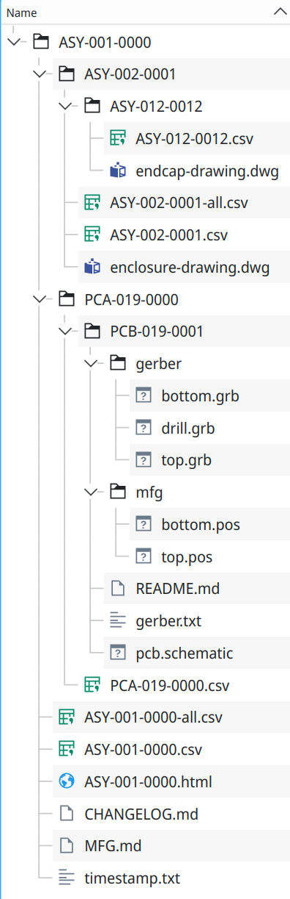

[](https://github.com/git-plm/gitplm/actions)

[](https://goreportcard.com/report/github.com/git-plm/gitplm)

## Product Lifecycle Management (PLM) in Git.

Additional documents:

- [Part numbers](https://github.com/git-plm/parts/blob/main/partnumbers.md)
- [Changelog](CHANGELOG.md)

GitPLM is a tool and a collection of best practices for managing information
needed to manufacture products.

**The fundamental thing you want to avoid in any workflow is tedious manual
operations that need to made over and over. You want to do something once, and
then your tools do it for you from then on. This is the problem that GitPLM
solves.**

GitPLM does several things:

- combines source BOMs with the partmaster to generate BOMs with manufacturing
  information.
- automate the generation of release/manufacturing information
- create combined BOMs that include parts from all sub-assemblies
- gathers release data for all custom components in the design into one
  directory for release to manufacturing.

An example output is shown below:



GitPLM is designed for small teams building products. We leverage Git to track
changes and use simple file formats like CSV to store BOMs, partmaster, etc.

## Video overview

[GitPLM overview](https://youtu.be/rSGHQXkrZmc)

## Installation

You can [download a release](https://github.com/git-plm/gitplm/releases) for
your favorite platform. This tool is a self-contained binary with no
dependencies.

Alternatively, you can:

- `go intstall github.com/git-plm/gitplm@latest`

or

- clone the Git repo and run: `go run .`

## Usage

Type `gitplm` from a shell to see commandline options:

```
Usage of gitplm:
  -release string
	      Process release for IPN (ex: PCB-056-0005, ASY-002-0023)
  -version int
        display version of this application
```

## Configuration

GitPLM supports configuration via YAML files. The tool will look for configuration files in the following order:

1. Current directory: `gitplm.yaml`, `gitplm.yml`, `.gitplm.yaml`, `.gitplm.yml`
2. Home directory: `~/.gitplm.yaml`, `~/.gitplm.yml`

Example configuration file:

```yaml
pmDir: /path/to/partmaster/directory
```

Available configuration options:

- `pmDir`: Specifies the directory containing the partmaster.csv file

## Part Numbers

Each part used to make a product is defined by a
[IPN (Internal Part Number)](https://github.com/git-plm/parts/blob/main/partnumbers.md).
The convention used by GitPLM is: `CCC-NNN-VVVV`

- `CCC`: major category (RES, CAP, DIO, etc)
- `NNN`: incrementing sequential number for each part
- `VVVV`: variation to code variations of a parts typically with the **same
  datasheet** (resistance, capacitance, regulator voltage, IC package, etc.)
  Also used to encode the version of custom parts or assemblies.

## Partmaster

A single [`partmaster.csv`](example/partmaster.csv) file is used for the entire
organization and contains internal part numbers (IPN) for all assets used to
build a product. For externally sourced parts, purchasing information such as
manufacturer part number (MPN) is also included.

If multiple sources are available for a part, these can be entered on additional
lines with the same IPN, and different Manufacturer/MPN specified. GitPLM will
merge other fields like Description, Value, etc so these only need to be
specified on one of the lines. The `Priority` column is used to select the
preferred part (lowest number wins). If no `Priority` is set, it defaults to 0
(highest priority). Currently, GitPLM picks the highest priority part and
populates that in the output BOM. In the future, we could add additional columns
for multiple sources.

CAD tool libraries should contain IPNs, not MPNs. _Why not just put MPNs in the
CAD database?_ The fundamental reason is that a single part may be used in 100's
of different places and dozens of assemblies. If you need to change a supplier
for a part, you don't want to manually modify a dozen designs, generate new
BOMs, etc. This is manual, tedious, and error prone. What you want to do is
change the manufacturer information in the partmaster and then automatically
generate new BOMs for all affected products. Because the BOMs are stored in Git,
it is easy to review what changed.

## Components you manufacture

A product is typically a collection of custom parts you manufacture and
off-the-shelf parts you purchase. Custom parts are identified by the following
`CCC`s:

| Code | Description                                                                                                                                                                                                                                      |
| ---- | ------------------------------------------------------------------------------------------------------------------------------------------------------------------------------------------------------------------------------------------------ |
| PCA  | Printed Circuit Assembly. The version is incremented any time the BOM for the assembly changes.                                                                                                                                                  |
| PCB  | Printed Circuit board. This category identifies the bare PCB board.                                                                                                                                                                              |
| ASY  | Assembly (can be mechanical or top level subassembly -- typically represented by BOM and documentation). Again, the variation is incremented any time a BOM line item changes. You can also use product specific prefixes such as GTW (gateway). |
| DOC  | standalone documents                                                                                                                                                                                                                             |
| DFW  | data -- firmware to be loaded on MCUs, etc                                                                                                                                                                                                       |
| DSW  | data -- software (images for embedded Linux systems, applications, programming utilities, etc)                                                                                                                                                   |
| DCL  | data -- calibration data for a design                                                                                                                                                                                                            |
| FIX  | manufacturing fixtures                                                                                                                                                                                                                           |

If IPN with the above category codes are found in a BOM, GitPLM looks for
release directory that matches the IPN and then soft-links from the release
directory to the sub component release directory. In this way we build up a
hierarchy of release directories for the entire product.

## Source and Release directories

For parts you produce, GitPLM scans the directory tree looking for source
directories which are identified by one or both of the following files:

- an input BOM. Ex: `ASY-023.csv`
- a release configuration file. Ex: `PCB-019.yml`

If either of these is found, GitPLM considers this a source directory and will
use this directory to generate release directories.

A source directory might contain:

- A PCB designs
- Application source code
- Firmware
- Mechanical design files
- Test procedures
- User documentation
- Test Fixures/Procedures

Release directories are identified by a full IPN. Examples:

- `PCA-019-0012`
- `ASY-012-0002`
- `DOC-055-0006`

## Special Files

The following files will be copied into the release directory if found in the
project directory:

- `MFG.md`: contains notes for manufacturing
- `CHANGELOG.md`: contains a list of changes for each version. See
  [keep a changelog](https://keepachangelog.com) for ideas on how to structure
  this file. Every source directory should have a `CHANGELOG.md`.

## Release configuration

A release configuration file (`CCC-NNN.yml`) in the source directory can be used
to customize the release process.

The file format is [YAML](https://yaml.org/), and an example is shown below:

```
remove:
  - cmpName: Test point
  - cmpName: Test point 2
  - ref: D12
add:
  - cmpName: "screw #4,2"
    ref: S3
    ipn: SCR-002-0002
hooks:
  - date -Iseconds > {{ .RelDir }}/timestamp.txt
  - |
    echo "processing {{ .SrcDir }}"
    echo "hi #1"
    echo "hi #2"
copy:
  - gerber
  - mfg
  - pcb.schematic
required:
  - PCA-019-0002_ibom.html
```

The following template variables are available:

- `RelDir`: the release directory that GitPLM is generating
- `SrcDir`: the source directory GitPLM is pulling information from

Supported operations:

- `remove`: remove a part from a BOM
- `add`: add a part to a BOM
- `copy`: copy a file or dir to the release directory
- `hooks`: run shell scripts (currently Linux/MacOS only). Can be used to build
  software, generate PDFs, etc.
- `required`: looks for required files in the release directory and stops with
  an error if they are not found. This is used to check that manually generated
  files have been populated.

The release process should be automated as much as possible to process the
source files and generate the release information with no manual steps.

## Examples

See the examples folder. You can run commands like to exercise GitPLM:

- `go run . -release ASY-001-0000`
- `go run . -release PCB-019-0001`

`go run .` is used when working in the source directory. You can replace this
with `gitplm` if you have it installed.

## Principles

- manual operations/tweaks to machine generated files are bad. If changes are
  made (example a BOM line item add/removed/changed), this needs to be defined
  declaratively and then this change applied by a program. Ideally this
  mechanism is also idempotent, so we describe where we want to end up, not
  steps to get there. The program can determine how to get there.
- the number of parts used in a product is bounded, and can easily fit in
  computer memory (IE, we probably don't need a database for small/mid sized
  companies)
- the total number of parts a company may use (partmaster) is also bounded, and
  will likely fit in memory for most small/mid sized companies.
- tracking changes is important
- review is important, thus Git workflow is beneficial
- ASCII (text) files are preferred as they can be manually edited and changes
  easily review in Git workflows.
- versions are cheap -- `VVVV` should be incremented liberally.
- PLM software should not be tied to any one CAD tool, but should be flexible
  enough to work with any CAD output.

## Additional notes

- use CSV files for partmaster and all BOMs.
  - _rational: can be read and written by excel, libreoffice, or by machine_
  - _rational: easy to get started_
- versions in part numbers are sequential numbers: (0, 1, 2, 3, 4)
  - _rational: easy to use in programs, sorting, etc_
- CAD BOMs are never manually "scrubbed". If additional parts are needed in the
  assembly, create a higher level BOM that includes the CAD generated BOM, or
  create a `*.yml` file to declaratively describe modifications to the BOM.
  - _rational: since the CAD program generates the BOM in the first place, any
    manual processing of this BOM will only lead to mistakes._
- CSV files should be delimited with ';' instead of ','.
  - _rational: comma is useful in lists, descriptions, etc._
- Tooling is written in Go.
  - _rational:_
    - _Go programs are reasonably
      [reliable](http://bec-systems.com/site/1625/why-are-go-applications-so-reliable)_
    - _it is easy to generate standalone binaries for most platforms with no
      dependencies_
    - _Go is fast_
    - _Go is easy to read and learn._
    - _The Go [package ecosystem](https://pkg.go.dev/) is quite extensive.
      [go-git](https://pkg.go.dev/github.com/go-git/go-git/v5) may be useful for
      tight integration with Git._
    - _Program can be started as a command line program, but eventually grow
      into a full-blown web application._

## Reference Information

- https://www.awkwardengineer.com/pages/writing
- https://github.com/jaredwolff/eagle-plm
- https://www.jaredwolff.com/five-reasons-your-company-needs-an-item-master/
- https://www.aligni.com/
- https://kitspace.org/
- https://www.buyplm.com/plm-good-practice/part-numbering-system-software.aspx
- https://github.com/Gasman2014/KC2PK
